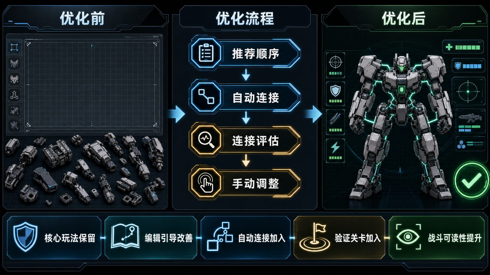

# Eidolon Circuit 游戏玩法与设计优化汇总

日期：2026-06-13
分支：`codex/yhzlxp-eidolon-work`
范围：截至目前已经完成或已经形成设计文档的玩法与设计侧优化

## 摘要

截至目前，优化工作没有改变游戏的核心设计理念：玩家仍然围绕真实拓扑组装单位，配置动力、散热、行动模块和武器系统，并在既有战斗规则下进行对抗。当前工作的重点是让原有设计更容易理解、更安全地操作，也更容易被测试和复查。

第一批基础优化已经进入远端基线，`origin/main` 与 `origin/codex/yhzlxp-eidolon-work` 已包含 `c6cb17d`，其中包括 `80a7629` 所完成的功能优化路线图工作。当前本地分支在此基础上又领先 6 个提交，新增了单位编辑器的新手引导设计、自动连接设计、自动连接服务，以及推荐组装流程中的连接检查节点。

## 没有改变的部分

以下内容在优化过程中保持稳定：

- 核心战斗规则、胜利条件、单位阵容理念和伤害分类没有改变。
- 空白画布上的自由拓扑组装仍然是单位构建的真实模型。
- 行动模块仍然是定义攻击和主动行为的核心方式。
- 现有合法性检查和存档结构仍然是权威标准。
- 数值平衡不是本轮优化的目标。
- 在当前架构仍然需要 Godot 节点副作用的地方，`main.gd` 继续负责运行时节点行为；可以安全拆出的纯逻辑已逐步移动到 service 或 controller 中。

## 优化总览

| 优化区域 | 优化前 | 优化后 | 玩家侧影响 | 状态 |
| --- | --- | --- | --- | --- |
| 基线验证 | 本地信心依赖分散的探针和人工判断。 | P0-P5 路线图检查、探针清单验证、Godot check-only 与聚焦契约探针形成可重复验证路径。 | 可以更安全地迭代，同时不改变游戏手感。 | 远端基线 |
| 模式切换 | 菜单、设置、已保存单位、训练、战斗和编辑器之间有更多策略逻辑散落在包装层。 | 模式拥有者和 controller 承担更多纯粹的切换与清理意图。 | 页面残留状态更少，返回流程更可预期。 | 远端基线 |
| 队伍编辑可用性 | 编辑器暴露真实规则，但部分失败原因不够直观。 | board、catalog、controller 反馈和聚焦探针覆盖放置、选择、保存反馈、布局与溢出。 | 玩家能看到更清楚的失败原因，而不是被简化规则。 | 远端基线 |
| 已保存单位与训练 | 删除、导入和训练衔接在焦点、回退单位和角色上下文上较脆弱。 | 已保存单位焦点、删除修复、训练准备、假人回退、角色保持和席位确认都有覆盖。 | 进入训练前的困惑和死路减少。 | 远端基线 |
| 战斗可读性与运行反馈 | HUD、诊断、投射物、接触判定等逻辑更集中在内联代码中，UI 漂移风险更高。 | HUD 状态、诊断、VFX 预算、投射物生命周期、命中查询、目标获取、地图遮挡和接触决策由服务与探针守护。 | 战斗信息更清楚，运行时行为更稳定。 | 远端基线 |
| 单位编辑器首次引导 | 原有提示偏上下文，没有完整覆盖从空白画布到合法单位保存的第一次路径。 | 已形成新手引导设计：开始、跳过、重播、聚焦提示、清单，以及七步首个单位路径。 | 新玩家可以逐步理解真实编辑器流程，而不是进入一个被简化的假编辑器。 | 本地设计稿 |
| 单位编辑器推荐组装路径 | 玩家可以任意选择零件顺序，但没有明确推荐路线。 | `UnitEditorAssemblyGuideService` 定义推荐顺序：躯干、关节/肌肉、武器、连接、引擎、散热、推进器、灵魂/代码、行动模块。 | 新手有默认路线，熟练玩家仍然可以自由使用零件库。 | 本地已实现 |
| 单位编辑器部件连接 | 玩家需要手动推断和验证拓扑连接。 | `UnitEditorAutoConnectionService` 可以规划确定性的安全连接；界面新增自动连接、评估连接和恢复建议。 | 系统给出最可能合法的拓扑方案，同时保留手动调整权。 | 本地已实现 |
| 连接评估节点 | 连接阶段没有单独的准备状态。 | 连接可以处于 `passed`、`repairable`、`blocked` 或 `stale`；手动改变拓扑后会标记为待重新评估。 | 玩家知道当前是否能继续，还是需要修复或重新评估连接。 | 本地已实现 |

## 单位编辑流程前后对比

### 优化前

单位编辑器已经支持高级自由画布构建：

1. 从零件库选择物理部件。
2. 将部件放到画布上。
3. 通过布局工具或磁吸行为手动连接接口。
4. 调整姿态和侧挂武器方向。
5. 配置载荷与行动模块。
6. 在验证通过后保存或测试。

这套流程保留了创作自由，但第一次面对空白画布时门槛较高。新玩家能看到零件、画布和提示，却仍然可能不知道推荐顺序，也不知道当前拓扑是否已经准备好。

### 优化后

当前本地分支在不移除专家自由度的前提下，增加了一条更清楚的新手路径：

1. 引导服务按顺序推荐主要组装阶段。
2. 物理部件选择仍然保持自由。
3. 完成躯干、关节/肌肉和武器后，引导停在 `connection` 节点。
4. “自动连接”会对已有节点应用确定性的安全连接。
5. 玩家仍然可以解绑、拖动、重新连接或调整侧挂武器。
6. 任何改变拓扑的手动操作都会把连接评估标记为 `stale`。
7. “评估连接”必须通过后，引导才会越过连接检查节点。
8. 手动调整后，可以用“恢复建议”重新应用系统推荐的安全方案。

最终结果是一条推荐路径，而不是一条锁死路径。玩家仍然可以自定义组装顺序和连接方式，但系统会把大多数人最容易接受的路径明确展示出来，并让这条路径可检查、可修复。

## 当前分支证据

远端基线证据：

- `80a7629 Complete functional optimization roadmap`
- `c6cb17d Merge remote-tracking branch 'origin/codex/yhzlxp-eidolon-work' into codex/yhzlxp-eidolon-work`
- `docs/local_development_status.md`
- `docs/plans/2026-06-12-functional-optimization-roadmap.md`
- `docs/assets/eidolon-circuit-functional-optimization-report.png`

当前本地分支相对 `origin/main` 新增的证据：

- `a003354 Document unit editor onboarding design`
- `ffffe48 Document unit editor auto connection design`
- `008597e Add unit editor auto connection implementation plan`
- `c4a5920 Add unit editor auto connection service`
- `5872ded Fix auto connection planning compliance`
- `2339cef Add unit editor connection checkpoint`

最近单位编辑器工作涉及的关键文件：

- `scripts/services/unit_editor_auto_connection_service.gd`
- `scripts/services/unit_editor_assembly_guide_service.gd`
- `scripts/main.gd`
- `tools/unit_editor_auto_connection_service_probe.gd`
- `tools/unit_editor_auto_connection_ui_probe.gd`
- `tools/unit_editor_assembly_guide_service_probe.gd`
- `tools/unit_editor_assembly_guide_ui_probe.gd`

## 验证快照

最近一次本地连接检查节点验证结果：

- `UNIT_EDITOR_AUTO_CONNECTION_SERVICE_PROBE ok`
- `UNIT_EDITOR_AUTO_CONNECTION_UI_PROBE ok`
- `UNIT_EDITOR_ASSEMBLY_GUIDE_SERVICE_PROBE ok`
- `UNIT_EDITOR_ASSEMBLY_GUIDE_UI_PROBE ok`
- Godot `--check-only` 退出码为 `0`；早期 macOS headless 运行中记录的 ObjectDB 警告在 2026-06-17 最新定向验证中未复现，后续继续观察。
- `TEXT_OVERFLOW_PROBE` 在中文和英文覆盖下报告 0 个文本溢出失败。
- 功能提交前 `git diff --check` 没有输出。
- `jq empty tools/probe_manifest.json` 通过。

## 设计影响

当前设计方向更加清楚：

- 游戏仍然是以构造为核心的战斗游戏，而不是菜单式配装器。
- 单位身份仍然来自拓扑结构、载荷、行动模块和战斗行为。
- 自动化是建议层：它降低摩擦，但不隐藏真实系统。
- 验证是显性的：玩家能看到当前步骤是已通过、可修复、被阻塞，还是已经过期。
- 推荐路线是教学层，而不是规则替代品。

## 建议的后续步骤

1. 用第一次接触游戏的玩家测试单位编辑器连接检查节点。
2. 如果推荐流程仍不足以支撑首次体验，再把已完成的新手引导设计实现为独立一轮工作。
3. 在下一块设计确认后，把推荐流程继续扩展到入场姿态、攻击动作和按键绑定。
4. 决定当前本地分支何时推送并交给测试人员对远端基线进行验证。
