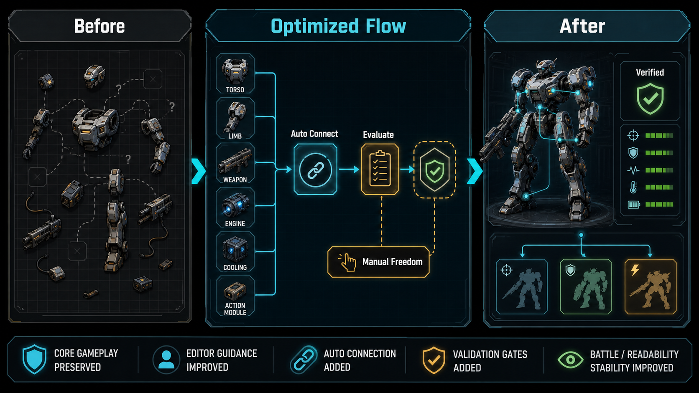

# Eidolon Circuit Gameplay And Design Optimization Summary

Date: 2026-06-13
Branch: `codex/yhzlxp-eidolon-work`
Scope: gameplay/design-facing optimization completed or documented so far

## Executive Summary

The optimization work so far has kept the original game idea intact: players still build units from physical topology, configure internal power/heat/action systems, and fight through the existing combat rules. The work has focused on making the current design easier to understand, safer to use, and easier to verify.

The largest baseline batch is already in the remote baseline through `origin/main`/`origin/codex/yhzlxp-eidolon-work` at `c6cb17d`, including the functional optimization roadmap completion work from `80a7629`. The current local branch is additionally ahead by six commits. Those local commits add Unit Editor onboarding design, auto-connection design, the auto-connection service, and the new connection checkpoint in the recommended assembly flow.

## What Did Not Change

These constraints stayed stable across the optimization work:

- Core battle rules, win condition, roster philosophy, and damage taxonomy were preserved.
- The free-canvas topology concept remains the real unit-construction model.
- Action modules remain the way attacks and active behaviors are defined.
- Existing legality checks and save schema remain authoritative.
- Numeric balance was not treated as the optimization target.
- `main.gd` still owns live Godot Node side effects where the current architecture requires it; pure decisions were moved into services/controllers when safe.

## Optimization Areas

| Area | Before | After | Player-facing effect | Status |
| --- | --- | --- | --- | --- |
| Baseline verification | Local confidence depended on many scattered probes and manual judgment. | P0-P5 roadmap checks, probe manifest validation, Godot check-only, and focused contract probes form a repeatable verification path. | Safer iteration without changing the game feel. | Remote baseline |
| Mode transitions | Menu, settings, saved units, training, battle, and editor transitions had more policy in wrappers. | Mode owners and controllers now own more pure transition/cleanup intent. | Fewer stale page states and more predictable return flows. | Remote baseline |
| Team Edit usability | The editor exposed the real rules, but some failures were harder to interpret. | Board/catalog/controller feedback and focused probes cover placement, selection, save feedback, layout, and overflow. | Players get clearer reasons without rules being softened. | Remote baseline |
| Saved Units and Training | Saved-unit deletion/import/training handoff could be fragile around focus, fallback, and role context. | Saved-unit focus, delete repair, training readiness, dummy fallback, role preservation, and seat confirmation are covered. | Fewer confusing dead ends before training. | Remote baseline |
| Battle readability and runtime feedback | HUD/diagnostics/projectile/contact behavior had more inline logic and more room for UI drift. | HUD state, diagnostics, VFX budget, projectile lifecycle, impact query, target acquisition, map occlusion, and contact decisions are guarded by services and probes. | Battle information is more readable and runtime behavior is less brittle. | Remote baseline |
| Unit Editor first-time guidance | Existing hints were contextual, but there was no complete first-run path from blank canvas to saved legal unit. | A documented onboarding design defines start/skip/replay, spotlight plus checklist, and a seven-step first-unit path. | New players can eventually be taught the real editor loop without a simplified fake editor. | Local design only |
| Unit Editor recommended assembly path | Players could select parts in any order, but there was no explicit recommended route. | `UnitEditorAssemblyGuideService` defines a recommended order: torso, joint/muscle, weapon, connection, engine, cooling, booster, soul/code, action module. | Beginners get a default path while experienced players can still use the catalog freely. | Local implementation |
| Unit Editor part connection | Players had to manually infer and validate topology connections. | `UnitEditorAutoConnectionService` can plan deterministic safe links; UI adds Auto Connect, Evaluate Connection, and Restore Suggested. | The system proposes the most likely legal topology but still leaves manual control intact. | Local implementation |
| Connection evaluation | There was no separate connection-phase readiness state. | Connection can be `passed`, `repairable`, `blocked`, or `stale`; manual topology changes mark evaluation stale. | Players know whether they can proceed or need to repair/reevaluate topology. | Local implementation |

## Unit Editor Flow Before And After

### Before

The Unit Editor already allowed advanced free-canvas construction:

1. Pick physical parts from the catalog.
2. Place parts on the canvas.
3. Manually connect sockets through layout tools or magnetic behavior.
4. Adjust pose and side-mounted weapon direction.
5. Configure payloads and action modules.
6. Save or test when the validator allowed it.

This preserved creative freedom, but it made the first blank-canvas experience demanding. A new player could see parts, a canvas, and hints, yet still not know the recommended order or whether the topology was ready.

### After

The current local branch adds a clearer beginner path without removing expert freedom:

1. The guide recommends the major assembly stages in order.
2. Physical part selection stays free-form.
3. After torso, joint/muscle, and weapon, the guide stops at `connection`.
4. `Auto Connect` applies deterministic safe links to existing nodes.
5. Players may still unlink, drag, reconnect, or adjust side-mounted weapons.
6. Any topology-changing edit marks connection evaluation as `stale`.
7. `Evaluate Connection` must pass before the guide advances past the connection checkpoint.
8. `Restore Suggested` can reapply the system's safe suggestion after manual changes.

The result is a recommended path, not a locked path. The player can still customize the build order and topology, but the guide makes the most common path visible and testable.

## Current Branch Evidence

Remote baseline evidence:

- `80a7629 Complete functional optimization roadmap`
- `c6cb17d Merge remote-tracking branch 'origin/codex/yhzlxp-eidolon-work' into codex/yhzlxp-eidolon-work`
- `docs/local_development_status.md`
- `docs/plans/2026-06-12-functional-optimization-roadmap.md`
- `docs/assets/eidolon-circuit-functional-optimization-report.png`

Current local branch evidence beyond `origin/main`:

- `a003354 Document unit editor onboarding design`
- `ffffe48 Document unit editor auto connection design`
- `008597e Add unit editor auto connection implementation plan`
- `c4a5920 Add unit editor auto connection service`
- `5872ded Fix auto connection planning compliance`
- `2339cef Add unit editor connection checkpoint`

Key files added or changed by the latest local Unit Editor work:

- `scripts/services/unit_editor_auto_connection_service.gd`
- `scripts/services/unit_editor_assembly_guide_service.gd`
- `scripts/main.gd`
- `tools/unit_editor_auto_connection_service_probe.gd`
- `tools/unit_editor_auto_connection_ui_probe.gd`
- `tools/unit_editor_assembly_guide_service_probe.gd`
- `tools/unit_editor_assembly_guide_ui_probe.gd`

## Verification Snapshot

Latest local verification for the Unit Editor connection checkpoint:

- `UNIT_EDITOR_AUTO_CONNECTION_SERVICE_PROBE ok`
- `UNIT_EDITOR_AUTO_CONNECTION_UI_PROBE ok`
- `UNIT_EDITOR_ASSEMBLY_GUIDE_SERVICE_PROBE ok`
- `UNIT_EDITOR_ASSEMBLY_GUIDE_UI_PROBE ok`
- Godot `--check-only` exited with code `0`; the known macOS headless ObjectDB warning remains non-blocking.
- `TEXT_OVERFLOW_PROBE` reported zero overflow failures in Chinese and English coverage.
- `git diff --check` produced no output before the feature commit.
- `jq empty tools/probe_manifest.json` passed.

## Design Impact

The core design direction is now clearer:

- The game remains a construction-first combat game, not a menu-driven loadout picker.
- Unit identity still emerges from topology, payloads, action modules, and battle behavior.
- Automation is advisory: it reduces friction without hiding the real system.
- Validation remains explicit: the player sees whether a step is ready, repairable, blocked, or stale.
- The recommended route is a teaching layer, not a rule replacement.

## Recommended Next Steps

1. Playtest the new Unit Editor connection checkpoint with a first-time player.
2. Implement the documented onboarding flow as a separate pass if the guide alone is not enough.
3. Extend the recommended flow from connection into entry pose, attack action, and key binding once the next design slice is approved.
4. Decide when the current local branch should be pushed and tested against the remote baseline.
